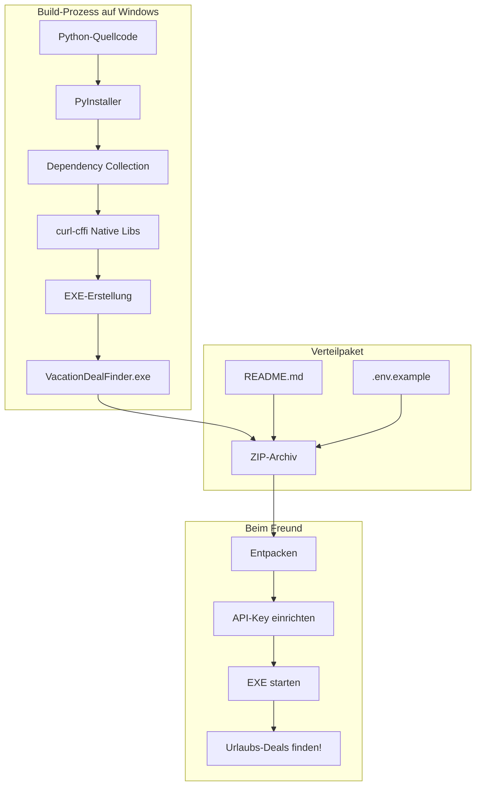

# Vollständiger Plan: Windows EXE für Vacation Deal Finder

## Übersicht

Dieser Plan enthält alle notwendigen Dateien und Schritte, um das Vacation Deal Finder Tool als eigenständige Windows-EXE zu erstellen und an einen Freund zu senden.

---

## Datei 1: `vacation_finder.spec` (PyInstaller-Konfiguration)

```python
# -*- mode: python ; coding: utf-8 -*-
"""
PyInstaller Specification File for Vacation Deal Finder
Creates a standalone Windows executable with all dependencies

Usage:
    pyinstaller vacation_finder.spec
"""

import sys
import os
from PyInstaller.utils.hooks import collect_all, collect_data_files

# Block cipher for bytecode encryption (optional)
block_cipher = None

# --- Collect curl-cffi with all native libraries ---
# This is critical for the scraper to work
curl_cffi_datas = []
curl_cffi_binaries = []
curl_cffi_hiddenimports = []

try:
    datas, binaries, hiddenimports = collect_all('curl_cffi')
    curl_cffi_datas.extend(datas)
    curl_cffi_binaries.extend(binaries)
    curl_cffi_hiddenimports.extend(hiddenimports)
except Exception as e:
    print(f"Warning: Could not collect curl_cffi: {e}")

# --- Collect other packages with data files ---
additional_datas = []
additional_datas += collect_data_files('fpdf2', include_py_files=False)

# --- Hidden imports that PyInstaller might miss ---
hidden_imports = [
    'tkinter',
    'tkinter.ttk',
    'tkinter.messagebox',
    'tkinter.filedialog',
    'asyncio',
    'json',
    'datetime',
    'threading',
    'webbrowser',
    'dotenv',
    'bs4',
    'beautifulsoup4',
    'httpx',
    'curl_cffi',
    'curl_cffi.requests',
    'fpdf2',
    'urllib.parse',
    're',
    'random',
    'time',
    # Project modules
    'holland_agent',
    'booking_scraper',
    'airbnb_scraper_enhanced',
    'weather_integration',
    'deal_ranker',
    'favorites_manager',
    'report_generator',
    'rate_limit_bypass',
    'scraper_health',
]

# Add curl_cffi hidden imports
hidden_imports.extend(curl_cffi_hiddenimports)

# --- Main Application Analysis ---
a = Analysis(
    ['gui_app.py'],
    pathex=[],
    binaries=[],
    datas=additional_datas + curl_cffi_datas,
    hiddenimports=hidden_imports,
    hookspath=[],
    hooksconfig={},
    runtime_hooks=[],
    excludes=[
        'matplotlib',  # Not needed, reduces size
        'numpy',       # Not needed
        'pandas',      # Not needed
        'pytest',      # Test framework not needed
        'IPython',     # Not needed
    ],
    win_no_prefer_redirects=False,
    win_private_assemblies=False,
    cipher=block_cipher,
    noarchive=False,
)

# Add curl_cffi binaries to the analysis
a.binaries.extend(curl_cffi_binaries)

# --- Create PYZ archive ---
pyz = PYZ(a.pure, a.zipped_data, cipher=block_cipher)

# --- Create EXE (Single File Mode) ---
exe = EXE(
    pyz,
    a.scripts,
    a.binaries,
    a.zipfiles,
    a.datas,
    [],
    name='VacationDealFinder',
    debug=False,
    bootloader_ignore_signals=False,
    strip=False,
    upx=True,  # Enable UPX compression for smaller size
    upx_exclude=[],
    runtime_tmpdir=None,
    console=False,  # Set to True for debugging
    disable_windowed_traceback=False,
    argv_emulation=False,
    target_arch=None,
    codesign_identity=None,
    entitlements_file=None,
    icon=None,  # Add path to .ico file if you have an icon
)
```

---

## Datei 2: `build_windows.bat` (Build-Skript)

```batch
@echo off
echo ==========================================
echo   Vacation Deal Finder - Windows EXE Build
echo ==========================================
echo.

:: Check Python
python --version >nul 2>&1
if %ERRORLEVEL% neq 0 (
    echo ERROR: Python is not installed or not in PATH.
    echo Please install Python 3.8+ from python.org
    pause
    exit /b 1
)

:: Install PyInstaller
echo [1/4] Installing PyInstaller...
pip install pyinstaller --quiet

:: Install project dependencies
echo [2/4] Installing project dependencies...
pip install -r requirements.txt --quiet

:: Clean previous builds
echo [3/4] Cleaning previous builds...
if exist build rmdir /s /q build
if exist dist rmdir /s /q dist

:: Build EXE
echo [4/4] Building executable...
pyinstaller vacation_finder.spec --clean

if %ERRORLEVEL% neq 0 (
    echo.
    echo ERROR: Build failed!
    pause
    exit /b 1
)

echo.
echo ==========================================
echo   BUILD SUCCESSFUL!
echo   EXE location: dist\VacationDealFinder.exe
echo ==========================================
echo.

:: Create distribution folder
echo Creating distribution package...
if not exist "VacationDealFinder_Package" mkdir "VacationDealFinder_Package"
copy "dist\VacationDealFinder.exe" "VacationDealFinder_Package\"
copy "USER_README.md" "VacationDealFinder_Package\README.md"
copy ".env.example" "VacationDealFinder_Package\.env.example"

echo.
echo Package created in: VacationDealFinder_Package\
echo You can now zip this folder and send it to your friend!
pause
```

---

## Datei 3: `requirements_build.txt` (Build-Requirements)

```txt
# Production dependencies
httpx==0.25.0
python-dotenv==1.0.0
beautifulsoup4==4.12.0
curl-cffi
fpdf2==2.7.9

# Build dependency (only needed for building)
pyinstaller>=6.0.0

# Optional - remove if not needed to reduce EXE size
# patchright  # Uncomment if you need browser automation
```

---

## Datei 4: `.env.example` (Vorlage für API-Keys)

```env
# Vacation Deal Finder - Configuration
# Copy this file to .env and fill in your API keys

# OpenWeather API Key (FREE - Required for weather forecasts)
# Get your free key at: https://openweathermap.org/api
OPENWEATHER_API_KEY=your_openweather_api_key_here

# Firecrawl API Key (Optional - for enhanced scraping)
# Get at: https://firecrawl.dev
FIRECRAWAL_API_KEY=your_firecrawl_key_here

# Agent Browser Session (Optional)
AGENT_BROWSER_SESSION=vacation-deals
```

---

## Datei 5: `USER_README.md` (Anleitung für den Freund)

```markdown
# Vacation Deal Finder - Benutzeranleitung

## Installation

1. **Entpacken** Sie den Ordner an einen beliebigen Ort (z.B. Desktop)

2. **API-Key einrichten** (KOSTENLOS):
   - Gehen Sie zu https://openweathermap.org/api
   - Erstellen Sie einen kostenlosen Account
   - Kopieren Sie Ihren API-Key
   - Benennen Sie die Datei `.env.example` um zu `.env`
   - Öffnen Sie `.env` mit Notepad und fügen Sie Ihren Key ein:
     ```
     OPENWEATHER_API_KEY=dein_key_hier
     ```

3. **Programm starten**:
   - Doppelklick auf `VacationDealFinder.exe`
   - Falls Windows eine Warnung zeigt: "Weitere Informationen" -> "Trotzdem ausführen"

## Verwendung

1. **Ziele eingeben**: Mehrere Städte mit Komma trennen
   - Beispiel: `Amsterdam, Berlin, Ardennes`

2. **Reisedaten**: Format YYYY-MM-DD
   - Check-in: `2026-02-15`
   - Check-out: `2026-02-22`

3. **Gruppe und Budget**:
   - Anzahl Erwachsene
   - Maximales Budget pro Nacht (EUR)
   - Hund erlauben (Häckchen setzen)

4. **Suche starten**: Klick auf "Search Best Deals"

5. **Ergebnisse**:
   - Die besten Deals werden angezeigt
   - "Open HTML Report" öffnet detaillierte Übersicht
   - "Export PDF" speichert Ergebnisse als PDF

## Häufige Probleme

### "Keine Ergebnisse gefunden"
- Datum in der Zukunft?
- Budget zu niedrig?
- Andere Städte probieren

### "Wetter-Fehler"
- API-Key korrekt in .env eingetragen?
- Internetverbindung vorhanden?

### "Programm startet nicht"
- Windows-Defender prüfen
- Als Administrator ausführen

## Systemanforderungen

- Windows 10 oder 11
- Internetverbindung
- Ca. 100 MB Speicherplatz

## Support

Bei Problemen wenden Sie sich an den Absender dieser Software.
```

---

## Schritt-für-Schritt Anleitung für DICH

### Schritt 1: Dateien erstellen
Wechsle in den Code-Modus und erstelle folgende Dateien:
- `vacation_finder.spec`
- `build_windows.bat`
- `.env.example`
- `USER_README.md`

### Schritt 2: Auf Windows testen
Führe `build_windows.bat` auf einem Windows-PC aus:
```cmd
build_windows.bat
```

### Schritt 3: EXE testen
Starte `dist\VacationDealFinder.exe` und prüfe:
- GUI öffnet sich
- Suche funktioniert
- Wetter-Daten werden geladen

### Schritt 4: Paket erstellen
Erstelle ein ZIP-Archiv mit:
- `VacationDealFinder.exe`
- `README.md` (USER_README.md umbenannt)
- `.env.example`

### Schritt 5: An Freund senden
Sende das ZIP-Archiv mit einer kurzen E-Mail.

---

## Alternative: Nuitka (falls PyInstaller Probleme macht)

Falls PyInstaller nicht funktioniert, hier die Nuitka-Alternative:

### `build_nuitka.bat`
```batch
@echo off
echo Building with Nuitka...

:: Install Nuitka
pip install nuitka

:: Build with Nuitka
python -m nuitka `
    --standalone `
    --onefile `
    --windows-disable-console `
    --enable-plugin=tk-inter `
    --include-data-dir=.=. `
    gui_app.py

echo Build complete: gui_app.onefile-build\gui_app.exe
pause
```

---

## Wichtige Hinweise

### 1. curl-cffi auf Windows
- Benötigt Visual C++ Redistributable 2015-2022
- Falls Fehler: https://aka.ms/vs/17/release/vc_redist.x64.exe installieren

### 2. Antivirus-Fehlalarme
- PyInstaller-EXEs werden oft fälschlicherweise blockiert
- Lösung: Im Windows Defender eine Ausnahme hinzufügen

### 3. Dateigröße
- Erwartete Größe: 50-100 MB
- Falls zu groß: `patchright` aus requirements.txt entfernen

### 4. API-Keys
- OpenWeather ist kostenlos (1000 Anrufe/Tag)
- Freund muss eigenen Key erstellen

---

## Architektur-Diagramm



---

## Todo-Liste für Umsetzung

- [ ] `vacation_finder.spec` erstellen
- [ ] `build_windows.bat` erstellen
- [ ] `.env.example` erstellen
- [ ] `USER_README.md` erstellen
- [ ] Auf Windows testen
- [ ] ZIP-Paket erstellen
- [ ] An Freund senden