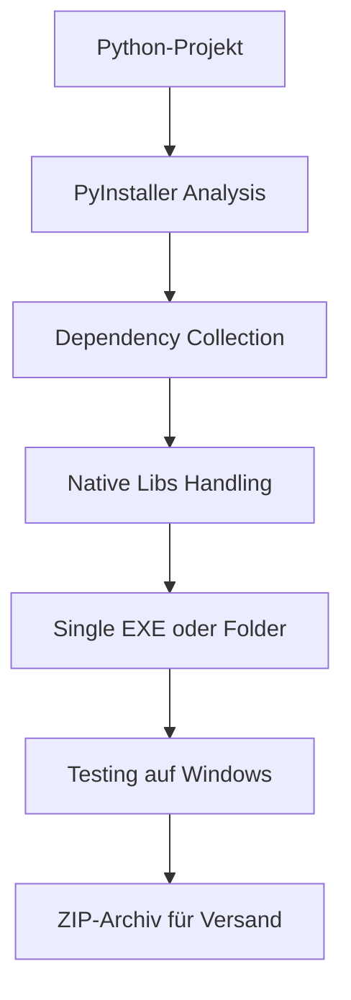
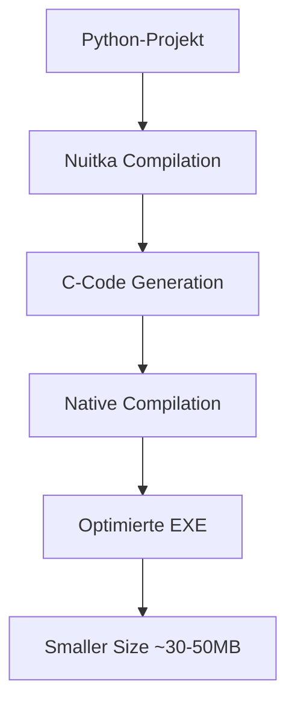

# Plan: Windows EXE-Erstellung für Vacation Deal Finder

## Projektanalyse

### Anwendungsübersicht
- **Hauptdatei**: [`gui_app.py`](gui_app.py) - Tkinter-GUI
- **CLI-Alternative**: [`main.py`](main.py) - Kommandozeileninterface
- **Kernkomponenten**: Scraper für Booking.com und Airbnb, Deal-Ranking, Wetter-Integration

### Kritische Abhängigkeiten (requirements.txt)
| Paket | Herausforderung | Lösung |
|-------|-----------------|--------|
| `curl-cffi` | Native libcurl-Bibliotheken | Muss in EXE eingebunden werden |
| `patchright` | Browser-Binaries | Optional - kann entfernt werden |
| `fpdf2` | Reine Python | Problemlos |
| `beautifulsoup4` | Reine Python | Problemlos |
| `httpx` | Reine Python | Problemlos |
| `python-dotenv` | Reine Python | Problemlos |

---

## Empfohlene Lösung: PyInstaller mit Nuitka als Alternative

### Option A: PyInstaller (Empfohlen für schnelle Erstellung)



**Vorteile:**
- Etabliert und gut dokumentiert
- Unterstützt `curl-cffi` mit `--collect-all`
- Single-File oder Folder-Mode möglich

**Nachteile:**
- Größere EXE-Datei (~50-100MB)
- Langsamerer Start bei Single-File

### Option B: Nuitka (Für kleinere EXE)



**Vorteile:**
- Kleinere EXE-Datei
- Schnellere Ausführung
- Besserer Schutz des Quellcodes

**Nachteile:**
- Längere Build-Zeit
- C-Compiler auf Windows benötigt

---

## Schritt-für-Schritt Plan

### Phase 1: Vorbereitung

1. **requirements.txt anpassen**
   - `patchright` entfernen (optional, reduziert Größe)
   - PyInstaller hinzufügen

2. **Spezifikationsdatei erstellen** (`vacation_finder.spec`)
   - Alle Python-Module einbinden
   - `curl-cffi` native Libraries sammeln
   - Daten-Dateien einbinden (falls nötig)

### Phase 2: Build-Prozess

3. **Build-Skript erstellen** (`build_windows.bat`)
   ```batch
   @echo off
   pip install pyinstaller
   pyinstaller vacation_finder.spec
   ```

4. **Testen auf Windows**
   - EXE auf frischem Windows testen
   - Alle Funktionen prüfen

### Phase 3: Paketierung

5. **Verteilpaket erstellen**
   - EXE + Abhängigkeiten
   - README für den Freund
   - Beispiel-.env Datei

---

## Detaillierte Dateien

### Benötigte neue Dateien:

1. **`vacation_finder.spec`** - PyInstaller-Konfiguration
2. **`build_windows.bat`** - Build-Skript
3. **`BUILD_README.md`** - Anleitung für dich
4. **`USER_README.md`** - Anleitung für den Freund

### Zu ändernde Dateien:

1. **`requirements.txt`** - PyInstaller hinzufügen
2. **`.env.example`** - Vorlage für API-Keys erstellen

---

## Wichtige Hinweise

### API-Keys
Die Anwendung benötigt:
- **OpenWeather API Key** (kostenlos): https://openweathermap.org/api
- Optional: Firecrawl API Key

### Bekannte Probleme

1. **curl-cffi auf Windows**
   - Benötigt Visual C++ Redistributable
   - Muss mit `--collect-all curl_cffi` eingebunden werden

2. **Antivirus-Fehlalarme**
   - PyInstaller-EXEs werden oft fälschlicherweise als Malware erkannt
   - Lösung: Code Signing oder Whitelist beim Freund

3. **Dateipfade**
   - Relative Pfade funktionieren in EXE anders
   - `sys._MEIPASS` für Ressourcen verwenden

---

## Nächste Schritte

1. PyInstaller-Spezifikationsdatei erstellen
2. Build-Skript erstellen
3. Auf Windows testen
4. Paket für den Freund zusammenstellen

---

## Alternative: Portable Python

Falls PyInstaller Probleme macht, kann auch eine portable Python-Installation verwendet werden:

1. WinPython herunterladen
2. Projekt hineinkopieren
3. Batch-Datei zum Starten erstellen
4. Alles als ZIP versenden

Dies ist einfacher, aber weniger elegant als eine einzelne EXE.
