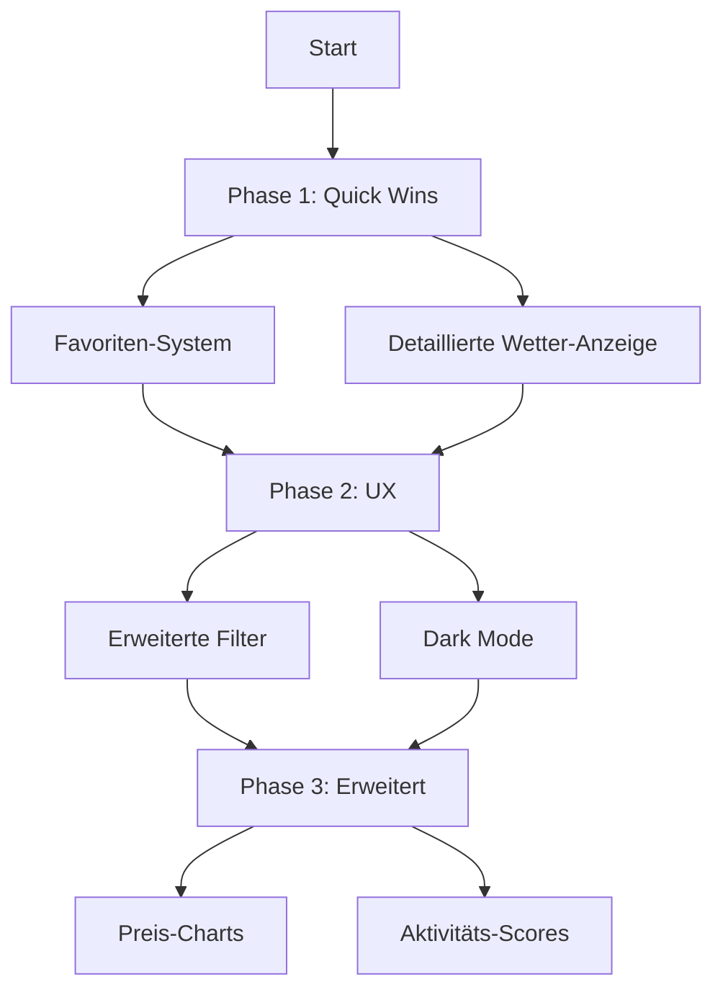

# Priorisierter Implementierungsplan

## Top 5 Features für Lars Urlaubs-Deals App

Basierend auf deiner Anfrage (Wetter-Integration + weitere Ideen) empfehle ich folgende Priorisierung:

---

## Phase 1: Quick Wins (Sofort umsetzbar)

### 1. Favoriten-System ⭐⭐⭐
**Komplexität:** Niedrig | **Nutzen:** Hoch

- Herz-Button für jeden Deal
- Favoriten in localStorage speichern
- Separate "Meine Favoriten" Ansicht
- Schneller Zugriff auf gespeicherte Deals

### 2. Detaillierte Wetter-Anzeige ⭐⭐⭐
**Komplexität:** Mittel | **Nutzen:** Hoch

Erweitere [`weather_integration.py`](weather_integration.py):
- Regenwahrscheinlichkeit (%)
- Windgeschwindigkeit (km/h)
- UV-Index
- 5-Tage Forecast mit Icons

Aktualisiere [`frontend_dashboard.html`](frontend_dashboard.html):
- Wetter-Badge mit Icon und Temperatur
- Detail-Panel mit erweiterten Wetter-Daten

---

## Phase 2: Verbesserte UX

### 3. Erweiterte Filter ⭐⭐⭐
**Komplexität:** Mittel | **Nutzen:** Hoch

Neue Filter-Optionen:
- Haustierfreundlich (bereits vorhanden)
- Parkplatz vorhanden
- WLAN verfügbar
- Stornierungsoptionen
- Mindestaufenthalt (Nächte)

### 4. Dark Mode ⭐⭐⭐
**Komplexität:** Mittel | **Nutzen:** Mittel

- CSS Dark Theme Variables
- Toggle-Button in Navbar
- Automatische Erkennung via `prefers-color-scheme`
- Alle Komponenten: Cards, Buttons, Text

---

## Phase 3: Erweiterte Features

### 5. Preis-Charts & Visualisierung ⭐⭐
**Komplexität:** Mittel | **Nutzen:** Hoch

- Chart.js Integration
- Preisverlauf pro Property
- Durchschnittspreis nach Stadt
- "Günstigste Zeit" Heatmap

### 6. Aktivitäts-basierte Wetter-Scores ⭐⭐
**Komplexität:** Mittel | **Nutzen:** Mittel

Neue Scores in [`weather_integration.py`](weather_integration.py):
- `beach_score` (Sonne, wenig Wind)
- `hiking_score` (Trocken, moderate Temperatur)
- `dog_walk_score` (nicht zu heiß/kalt)
- `cycling_score` (trocken, wenig Wind)

---

## Mermaid: Implementierungs-Reihenfolge

---

## Dateien die geändert werden müssen

| Feature | Dateien |
|---------|---------|
| Favoriten | [`frontend_dashboard.html`](frontend_dashboard.html), ggf. [`favorites_manager.py`](favorites_manager.py) |
| Wetter erweitern | [`weather_integration.py`](weather_integration.py), [`frontend_dashboard.html`](frontend_dashboard.html), [`deal_ranker.py`](deal_ranker.py) |
| Filter erweitern | [`frontend_dashboard.html`](frontend_dashboard.html), [`holland_agent.py`](holland_agent.py) |
| Dark Mode | [`frontend_dashboard.html`](frontend_dashboard.html) |
| Preis-Charts | [`frontend_dashboard.html`](frontend_dashboard.html), [`html_report_generator.py`](html_report_generator.py) |

---

## Nächster Schritt

Ich kann mit der Implementierung beginnen. Soll ich mit **Phase 1** (Favoriten + Detailliertes Wetter) starten?